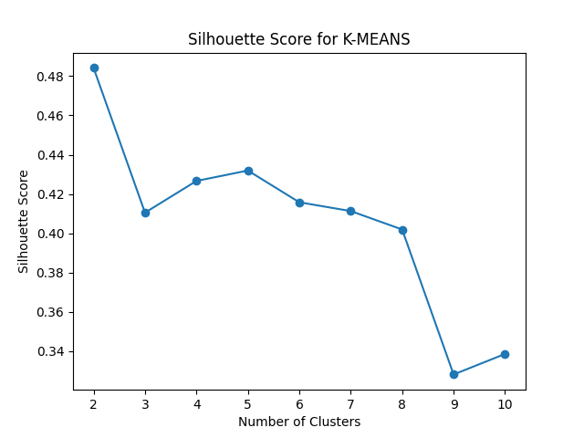
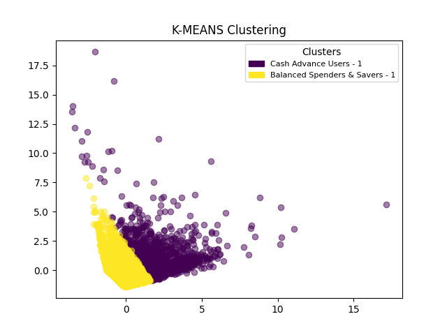
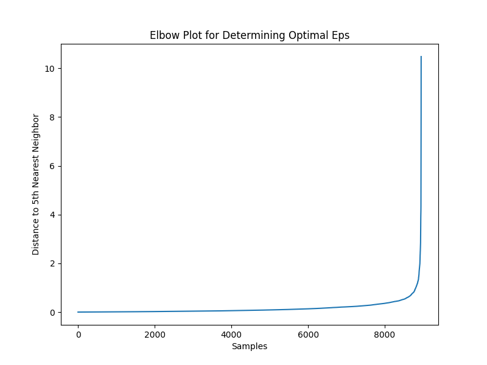
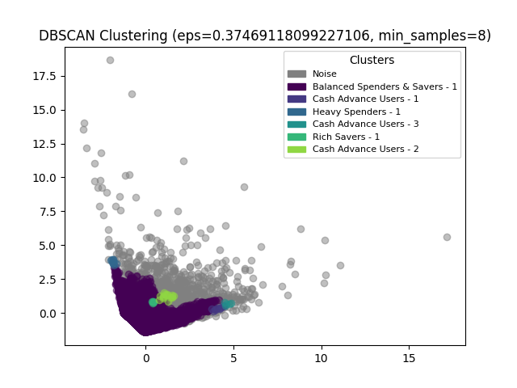

## Analýza clusteringu pro segmentaci uživatelů kreditních karet

Cílem tohoto projektu bylo využít dvou populárních algoritmů clusteringu, K-MEANS a DBSCAN, k segmentaci uživatelů kreditních karet. Dataset obsahoval různé parametry o uživatelích, jako jsou zůstatky na účtech, počty nákupů, částky čerpané přes cash advance a frekvenci nákupů. Analýza se zaměřila na rozpoznání a charakterizaci různých skupin uživatelů na základě těchto dat.

## K-MEANS Clustering

Prvním krokem bylo určení optimálního počtu clusterů pro algoritmus K-MEANS. Pro tento účel jsme použili Silhouette Score, který ukázal, že nejlepší počet clusterů je dva. Na následujícím obrázku je vidět průběh hodnot Silhouette Score pro různé počty clusterů, přičemž hodnota pro dva clustery dosahuje nejvyšší hodnoty (0.48).

Po aplikaci algoritmu K-MEANS jsme rozdělili uživatele do dvou skupin. První skupina zahrnuje uživatele označené jako "Balanced Spenders & Savers", kteří mají vyvážené finanční návyky, a druhá skupina představuje "Cash Advance Users", tedy uživatele s vysokým využíváním cash advance. Následující obrázek zobrazuje rozložení těchto dvou clusterů.

Charakteristika clusterů:

### Cluster 1 (Balanced Spenders & Savers - 1) characteristics:

|   | BALANCE | PURCHASES | CASH_ADVANCE | PURCHASES_FREQUENCY |
|---|---------|-----------|--------------|----------------------|
| count | 7586.00 | 7586.00 | 7586.00 | 7586.00 |
| mean  | 980.35  | 980.93  | 407.88   | 0.51   |
| std   | 988.83  | 1513.31 | 766.72   | 0.40   |
| min   | 6.10    | 6.10    | 6.10     | 0.00   |
| 25%   | 87.20   | 64.82   | 0.00     | 0.08   |
| 50%   | 551.38  | 379.66  | 0.00     | 0.50   |
| 75%   | 1393.03 | 1084.84 | 462.27   | 1.00   |
| max   | 5315.95 | 22746.82| 5291.77  | 1.00   |

### Cluster 0 (Cash Advance Users - 1) characteristics:

|   | BALANCE | PURCHASES | CASH_ADVANCE | PURCHASES_FREQUENCY |
|---|---------|-----------|--------------|----------------------|
| count | 1364.00 | 1364.00 | 1364.00 | 1364.00 |
| mean  | 5258.04 | 1571.99 | 4154.46  | 0.38   |
| std   | 2626.61 | 4104.56 | 3701.17  | 0.41   |
| min   | 78.11   | 0.00    | 0.00     | 0.00   |
| 25%   | 3381.59 | 8.10    | 1942.02  | 0.00   |
| 50%   | 4981.82 | 228.40  | 3510.74  | 0.17   |
| 75%   | 6600.15 | 1394.25 | 5409.62  | 0.83   |
| max   | 19043.14| 49039.57| 47137.21 | 1.00   |

## DBSCAN Clustering

Pro algoritmus DBSCAN jsme nemuseli předem stanovovat počet clusterů. Namísto toho jsme využili vzdálenost k pátému nejbližšímu sousedovi a pomocí tzv. "elbow rule" jsme určili vhodnou hodnotu parametru ϵ (eps). Optimální hodnota eps byla určena jako 0.3747, jak je vidět na následujícím grafu.

Výsledky DBSCAN clusteringu ukázaly, že algoritmus nalezl sedm clusterů a také odhalil šum (outliers). Na obrázku níže jsou jednotlivé clustery vizualizovány a popsány, například "Balanced Spenders & Savers", "Heavy Spenders" nebo "Cash Advance Users".

Charakteristika DBSCAN clusterů:

### Cluster 0 (Balanced Spenders & Savers - 1) characteristics:

|   | BALANCE | PURCHASES | CASH_ADVANCE | PURCHASES_FREQUENCY |
|---|---------|-----------|--------------|----------------------|
| count | 8013.00 | 8013.00 | 8013.00 | 8013.00 |
| mean  | 1141.24 | 738.90  | 611.35   | 0.47   |
| std   | 1410.75 | 1126.38 | 1150.28  | 0.40   |
| min   | 6.10    | 6.10    | 6.10     | 0.08   |
| 25%   | 97.30   | 19.92   | 0.00     | 0.08   |
| 50%   | 669.97  | 313.36  | 0.00     | 0.42   |
| 75%   | 1601.39 | 947.72  | 782.61   | 0.92   |
| max   | 9629.81 | 9751.90 | 8422.55  | 1.00   |

### Cluster 1 (Cash Advance Users - 1) characteristics:

|   | BALANCE | PURCHASES | CASH_ADVANCE | PURCHASES_FREQUENCY |
|---|---------|-----------|--------------|----------------------|
| count | 10.00  | 10.00   | 10.00     | 10.00   |
| mean  | 4505.39| 8.30    | 9469.32   | 0.01    |
| std   | 570.38 | 26.25   | 366.55    | 0.03    |
| min   | 3495.74| 0.00    | 9003.08   | 0.00    |
| 25%   | 4193.48| 0.00    | 9132.03   | 0.00    |
| 50%   | 4472.91| 0.00    | 9496.44   | 0.00    |
| 75%   | 4844.18| 6.00    | 9766.46   | 0.00    |
| max   | 5347.38| 83.90   | 9968.18   | 0.08    |

### Cluster 2 (Heavy Spenders - 1) characteristics:

|   | BALANCE | PURCHASES | CASH_ADVANCE | PURCHASES_FREQUENCY |
|---|---------|-----------|--------------|----------------------|
| count | 10.00  | 10.00   | 10.00     | 10.00   |
| mean  | 1034.59| 10977.96| 0.00      | 0.99    |
| std   | 179.48 | 442.54  | 0.00      | 0.00    |
| min   | 776.91 | 10243.48| 0.00      | 0.83    |
| 25%   | 920.78 | 10702.76| 0.00      | 1.00    |
| 50%   | 978.70 | 10909.30| 0.00      | 1.00    |
| 75%   | 1122.97| 11389.38| 0.00      | 1.00    |
| max   | 1311.73| 11522.90| 0.00      | 1.00    |

### Cluster 3 (Cash Advance Users - 3) characteristics:

|   | BALANCE | PURCHASES | CASH_ADVANCE | PURCHASES_FREQUENCY |
|---|---------|-----------|--------------|----------------------|
| count | 5.00   | 5.00    | 5.00      | 5.00    |
| mean  | 5751.28| 12.94   | 10093.27  | 0.01    |
| std   | 299.13 | 28.94   | 437.88    | 0.03    |
| min   | 5429.41| 0.00    | 9596.31   | 0.00    |
| 25%   | 5665.81| 0.00    | 9799.53   | 0.00    |
| 50%   | 5696.29| 0.00    | 9972.23   | 0.00    |
| 75%   | 5861.33| 64.71   | 10590.41  | 0.00    |
| max   | 5926.84| 64.71   | 10590.41  | 0.00    |

### Cluster 4 (Rich Savers - 1) characteristics:

|   | BALANCE | PURCHASES | CASH_ADVANCE | PURCHASES_FREQUENCY |
|---|---------|-----------|--------------|----------------------|
| count | 5.00   | 5.00    | 5.00      | 5.00    |
| mean  | 3744.65| 357.49  | 1539.55   | 0.88    |
| std   | 279.19 | 124.34  | 169.20    | 0.04    |
| min   | 3347.23| 207.00  | 1328.66   | 0.83    |
| 25%   | 3526.49| 256.00  | 1436.04   | 0.83    |
| 50%   | 3743.77| 368.44  | 1546.73   | 0.88    |
| 75%   | 3946.88| 475.36  | 1634.03   | 0.91    |
| max   | 4059.16| 480.00  | 1760.15   | 0.92    |

### Cluster 5 (Cash Advance Users - 2) characteristics:

|   | BALANCE | PURCHASES | CASH_ADVANCE | PURCHASES_FREQUENCY |
|---|---------|-----------|--------------|----------------------|
| count | 16.00  | 16.00   | 16.00     | 16.00   |
| mean  | 3434.56| 860.48  | 4589.81   | 0.93    |
| std   | 297.65 | 315.83  | 503.38    | 0.08    |
| min   | 3086.12| 230.90  | 3585.83   | 0.83    |
| 25%   | 3234.80| 690.05  | 4303.92   | 0.86    |
| 50%   | 3334.82| 910.35  | 4583.68   | 0.96    |
| 75%   | 3593.63| 1123.27 | 5024.83   | 1.00    |
| max   | 4070.50| 1307.16 | 5338.55   | 1.00    |

## Shrnutí

Použití dvou algoritmů clusteringu, K-MEANS a DBSCAN, nám umožnilo rozdělit uživatele kreditních karet do různých segmentů na základě jejich nákupního chování a finančních návyků. Každý z algoritmů poskytl unikátní pohled na segmentaci – K-MEANS umožnil rozdělení uživatelů na předem daný počet kategorií, zatímco DBSCAN rozpoznal složitější a necentrické clustery a identifikoval i šum. Tato analýza poskytuje užitečné informace pro lepší porozumění potřebám jednotlivých skupin uživatelů a pro zacílení vhodných finančních produktů.

