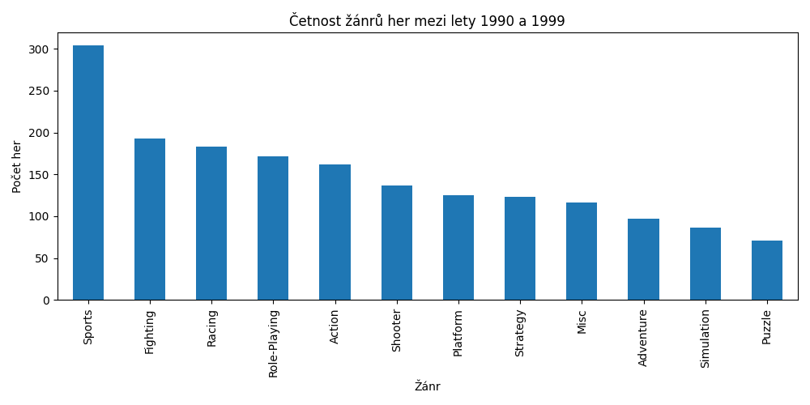
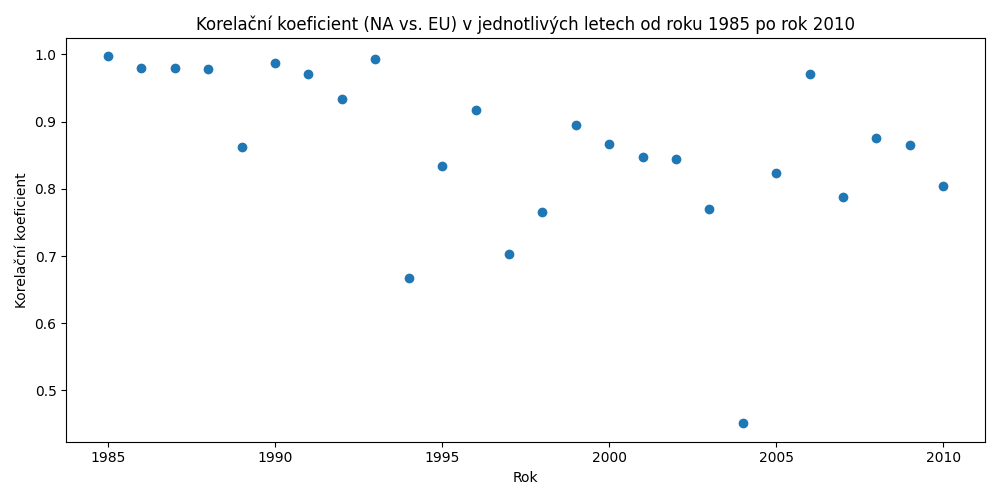
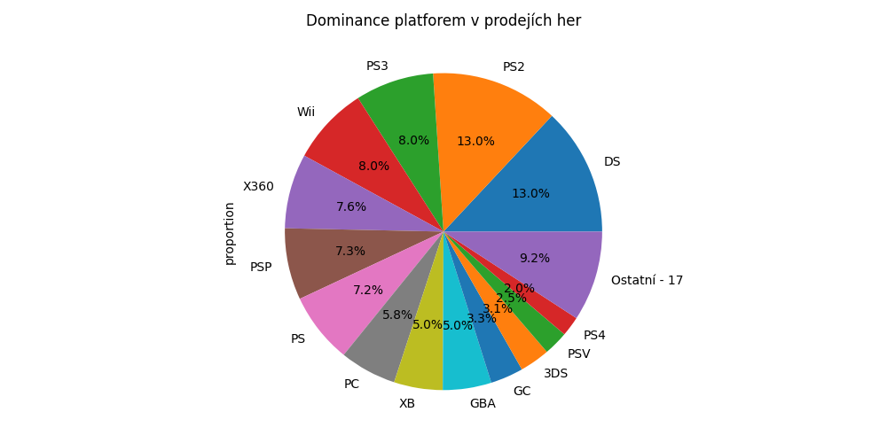
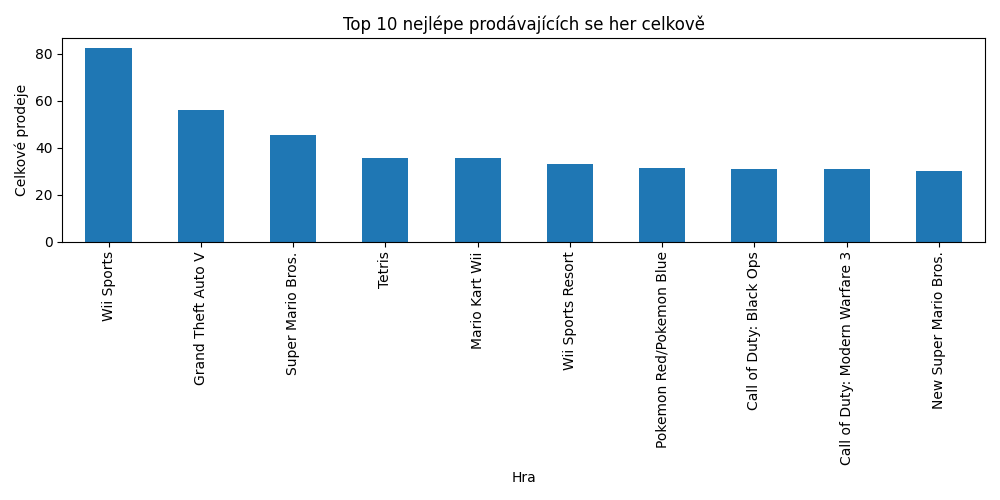
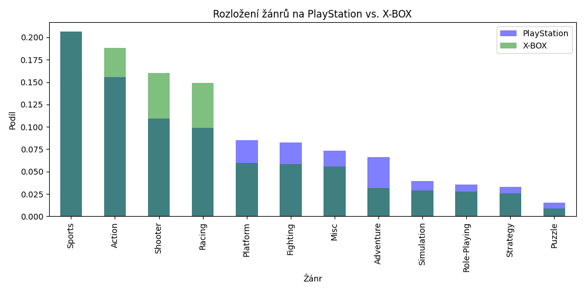

# Analýza dat herního prodeje (vgsales dataset)
[GitHub odkaz](https://github.com/Leon-Holub/softComputing/tree/master/data%20work)

Tento úkol se zaměřuje na analýzu datasetu herního prodeje pomocí Pythonu. Hlavním cílem bylo procvičit práci s daty a získat zajímavé poznatky z prodejních dat her na různých platformách. Každý úkol byl zpracován pomocí specifické funkce a výsledky jsou prezentovány níže, včetně vložených obrázků grafů.

## Úkoly a výsledky

### Úkol 1: Četnost žánrů her mezi lety 1990 (včetně) a 2000 (vyjma)
- **Funkce:** `task1(filteredData)`
- **Popis:** Graf zobrazuje četnost různých žánrů her vydaných mezi lety 1990 a 1999. Tento graf nám pomáhá pochopit, jaké herní žánry byly v tomto období nejpopulárnější.

---

### Úkol 2: Korelační koeficient mezi prodeji v NA a EU
- **Funkce:** `task2(df)`
- **Popis:** Výpočet korelačního koeficientu mezi prodeji her v Severní Americe (NA) a Evropě (EU) ukázal, že hodnota koeficientu je **0.7677267483702634**, což značí silnou pozitivní korelaci. To znamená, že hry, které byly úspěšné v NA, měly tendenci být také úspěšné v EU.

---

### Úkol 3: Korelační koeficient (NA vs. EU) v jednotlivých letech (1985-2010)
- **Funkce:** `task3(filteredData)`
- **Popis:** Graf zobrazuje korelační koeficient mezi prodeji v NA a EU pro jednotlivé roky v období 1985–2010. Tento graf nám pomáhá vidět, jak se korelace měnila v průběhu času.

---

### Úkol 4: Statistické údaje rozdílu v prodejích NA a EU pro žánr "Sports"
- **Funkce:** `task4(data)`
- **Popis:** Byly vypočteny základní statistické údaje rozdílu v prodejích mezi Severní Amerikou a Evropou pro žánr "Sports":
  - **Minimální rozdíl**: -4.95 (hra: FIFA 16)
  - **Maximální rozdíl**: 12.47 (hra: Wii Sports)
  - **Průměr**: 0.130648
  - **Směrodatná odchylka**: 0.548157

---

### Úkol 5: Dominance platforem v prodejích her
- **Funkce:** `task5(data)`
- **Popis:** Byl vytvořen koláčový graf, který zobrazuje podíl jednotlivých platforem na celkových prodejích her. Platformy s podílem pod 2 % byly sloučeny do kategorie "Ostatní". Graf jasně ukazuje dominanci největších herních platforem.

---

### Úkol 6: Nejlépe prodávajících se top 10 her celkově
- **Funkce:** `task6(data)`
- **Popis:** Byl vytvořen graf zobrazující 10 her s největším globálním prodejem, včetně součtu prodejů všech verzí dané hry.

---

### Úkol 7: Medián rozdílu v prodejích mezi NA a JP (2000-2010)
- **Funkce:** `task7(data)`
- **Popis:** Byl vypočítán medián rozdílu v prodejích mezi Severní Amerikou a Japonskem pro hry vydané mezi lety 2000 a 2010. Výsledky ukázaly, v kterých letech byl tento rozdíl největší a nejmenší.
- **Výsledky:**
  - **Největší rozdíl**: 0.115 (2001)
  - **Nejmenší rozdíl**: 0.05 (2006)
---

### Úkol 8: Srovnání žánrů her vydaných na PlayStation a X-BOX
- **Funkce:** `task8(data)`
- **Popis:** Porovnání rozložení žánrů na PlayStation a X-BOX ukázalo zajímavé rozdíly v oblíbenosti žánrů mezi těmito platformami.

