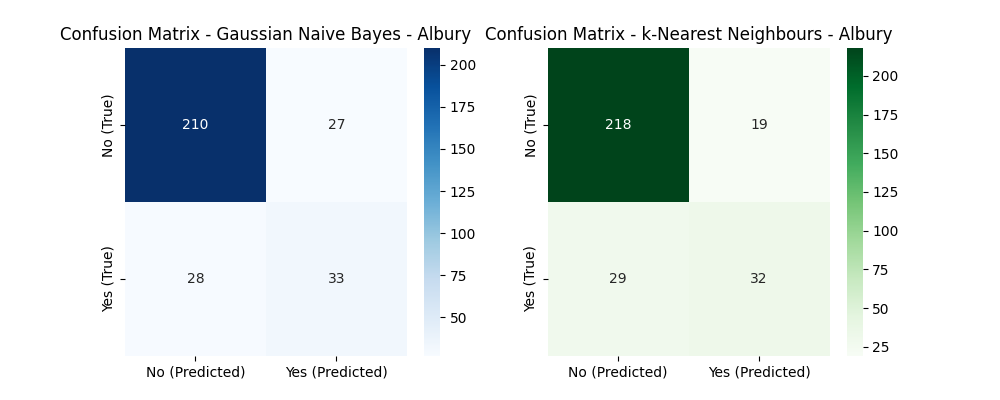

# Klasifikace pomocí základních algoritmů

## Cíl
Cílem tohoto projektu bylo zjistit, jestli dokážeme předpovědět, jestli bude druhý den pršet, pomocí dvou klasifikačních algoritmů: Gaussova naivního Bayesova klasifikátoru (Gaussian Naive Bayes - GNB) a k-nejbližších sousedů (k-Nearest Neighbours - kNN). Použili jsme k tomu dataset `weatherAUS`, který obsahuje údaje o počasí z různých lokalit v Austrálii.

## Dataset
Dataset `weatherAUS.csv` obsahuje různé informace o počasí, jako je teplota, vlhkost, tlak atd. Pro trénování mých modelů jsem použil tyto proměnné:
- **MinTemp**: Minimální teplota
- **MaxTemp**: Maximální teplota
- **Rainfall**: Úhrn srážek
- **Humidity3pm**: Vlhkost ve 3 odpoledne
- **Humidity9am**: Vlhkost v 9 dopoledne
- **Pressure9am**: Tlak vzduchu v 9 dopoledne
- **Pressure3pm**: Tlak vzduchu ve 3 odpoledne
- **RainToday**: Zda pršelo dnes (Yes/No)

Cílovou proměnnou byla `RainTomorrow`, která říká, jestli bude pršet druhý den.

## Příprava dat
- **Filtrování podle města**: Mohli jsme si vybrat konkrétní město nebo použít data ze všech měst.
- **Zpracování chybějících hodnot**: Chybějící hodnoty ve sloupcích `MinTemp` a `MaxTemp` jsme nahradili mediánem, aby se neztratilo moc dat. Ostatní řádky s chybějícími hodnotami jsme odstranili.
- **Normalizace dat**: Aby modely lépe fungovaly, převedli jsme vstupní data do rozsahu 0-1 pomocí `MinMaxScaler`.

## Metodologie
Použili jsme dva základní algoritmy pro klasifikaci:
1. **Gaussian Naive Bayes (GNB)**: Tento algoritmus předpokládá, že všechny vstupní proměnné jsou na sobě nezávislé a že mají normální rozdělení. Je to rychlý a jednoduchý algoritmus.
2. **k-Nearest Neighbours (kNN)**: Tento algoritmus hledá `k` nejbližších sousedů nového bodu a určuje jeho třídu podle většiny sousedů. My jsme zvolili `k = 5`.

## Cross-Validation
Pro hodnocení kvality modelů jsme použili 10-fold cross-validaci. To znamená, že jsme data rozdělili na 10 částí a model jsme trénovali a testovali 10krát, pokaždé na jiné části dat. Díky tomu jsme získali přesnější odhad výkonnosti modelů.

## Výsledky
### Přesnosti modelů
- **Albury**:
  - Gaussian Naive Bayes Classifier: 82%
  - k-Nearest Neighbours Classifier: 86%

- **Všechna města**:
  - Gaussian Naive Bayes Classifier: 81%
  - k-Nearest Neighbours Classifier: 83%

Z výsledků je vidět, že model kNN obecně dosahuje lepší přesnosti než Gaussian Naive Bayes, a to jak pro konkrétní město (Albury), tak pro všechna města dohromady. To znamená, že pro tento dataset je kNN lepší volbou, protože dokáže lépe využít podobnosti mezi vstupními daty.

## Confusion
Během každé iterace cross-validace jsme vykreslili confusion matrix pro každý model. :Confusion matrix ukazuje, jak dobře model dokáže klasifikovat předpovědi oproti skutečnosti. Na ose x jsou hodnoty predikované (Predicted) a na ose y jsou skutečné hodnoty (True), kde:
- ***True Positives (TP)***: Správně klasifikované pozitivní případy (např. pršelo a bylo předpovězeno, že bude pršet).
- ***True Negatives (TN)***: Správně klasifikované negativní případy (např. nepršelo a bylo předpovězeno, že nebude pršet).
- ***False Positives (FP)***: Špatně klasifikované pozitivní případy (např. nepršelo, ale model předpověděl, že bude pršet).
- ***False Negatives (FN)***: Špatně klasifikované negativní případy (např. pršelo, ale model předpověděl, že nebude pršet). 

Tyto matice jsem uložil do složek ve formátu `graphs/[název_města]/confusion_matrix_[název_města]_iteration_[číslo].png`.
Confusion matrices ukazují, kolik případů model správně nebo špatně klasifikoval, což nám pomáhá lépe pochopit, kde model chybuje.

říklad zobrazení dvou confusion matrices vedle sebe (osa x: Predicted, osa y: True):

|  |  |
|-----------------------------------------------------------------------|-----------------------------------------------------------------------|
|  |  |
|  |  |
|  |  |
|  |  |

## Závěr
- **Gaussian Naive Bayes** dosáhl průměrné přesnosti kolem 81-82 %, zatímco **kNN** dosáhl lepších výsledků kolem 83-86 %.
- kNN se zdá být lepší v modelování vztahů mezi vstupními daty, zejména u dat z konkrétního města, což naznačuje, že lépe využívá informace z homogenních vstupních údajů.