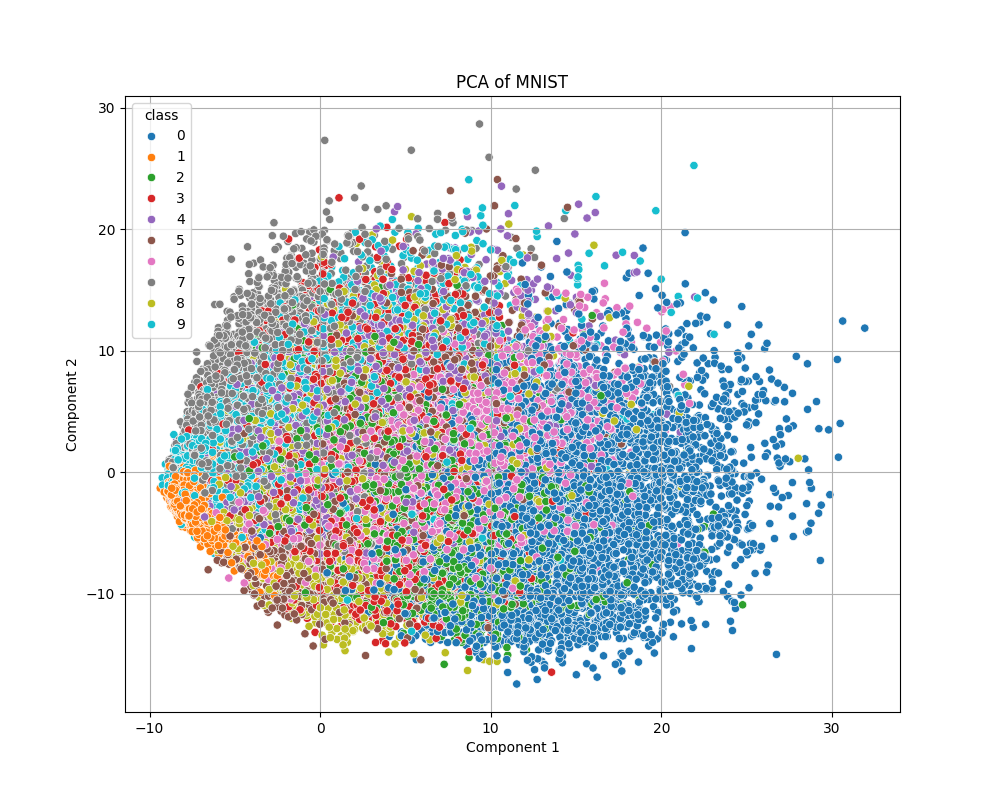
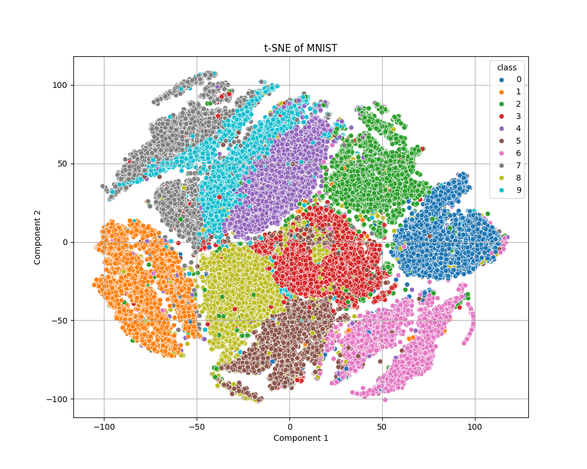
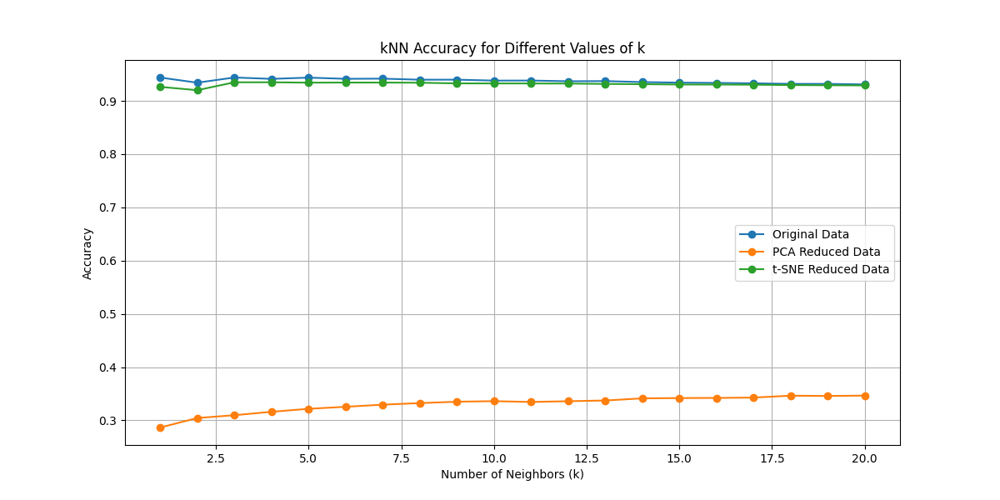

# Redukce dimenzionality MNIST a klasifikace kNN

## Výsledky
V tomto úkolu jsme použili dvě metody redukce dimenzionality, **PCA** a **t-SNE**, pro vizualizaci datasetu MNIST a následně jsme porovnali jejich vliv na klasifikaci pomocí kNN.

- **PCA**: Redukce pomocí PCA na dvě dimenze vedla ke ztrátě velkého množství informací. Přesnost klasifikace pomocí kNN byla nízká (přibližně 30-40 %), což znamená, že PCA není vhodná metoda pro tuto úlohu, pokud je cílem zachovat co největší klasifikační výkon.
  - 

- **t-SNE**: Redukce pomocí t-SNE byla mnohem efektivnější. Přestože se dimenzionalita snížila na 2, klasifikační přesnost byla srovnatelná s přesností původního datasetu (blízko 90 %). Díky t-SNE můžeme také pozorovat prolínání mezi čísly **4**, **7** a **9**, což ukazuje, že tyto třídy jsou vizuálně podobné a těžší pro model k rozlišení.
  - 

- **Původní dataset**: Klasifikace bez redukce dimenzionality dosáhla nejvyšší přesnosti, téměř 95 % pro většinu hodnot `k`. To ukazuje, že zachování plné dimenzionality poskytuje nejlepší výsledky pro klasifikaci pomocí kNN.

- 

## Shrnutí
- **PCA** je nevhodná pro tuto úlohu, protože výrazně snižuje klasifikační výkon kvůli ztrátě důležitých informací při redukci dimenzionality.
- **t-SNE** dosahuje mnohem lepších výsledků než PCA a poskytuje podobnou přesnost jako původní dataset, přičemž je rychlejší z důvodu snížení počtu dimenzí.
- V t-SNE vizualizaci lze vidět prolínání tříd **4**, **7**, a **9**, což poukazuje na jejich vizuální podobnost.

Pro tuto úlohu je t-SNE lepší alternativou k PCA, pokud je cílem dosáhnout vysoké přesnosti a současně zjednodušit vizualizaci dat.

